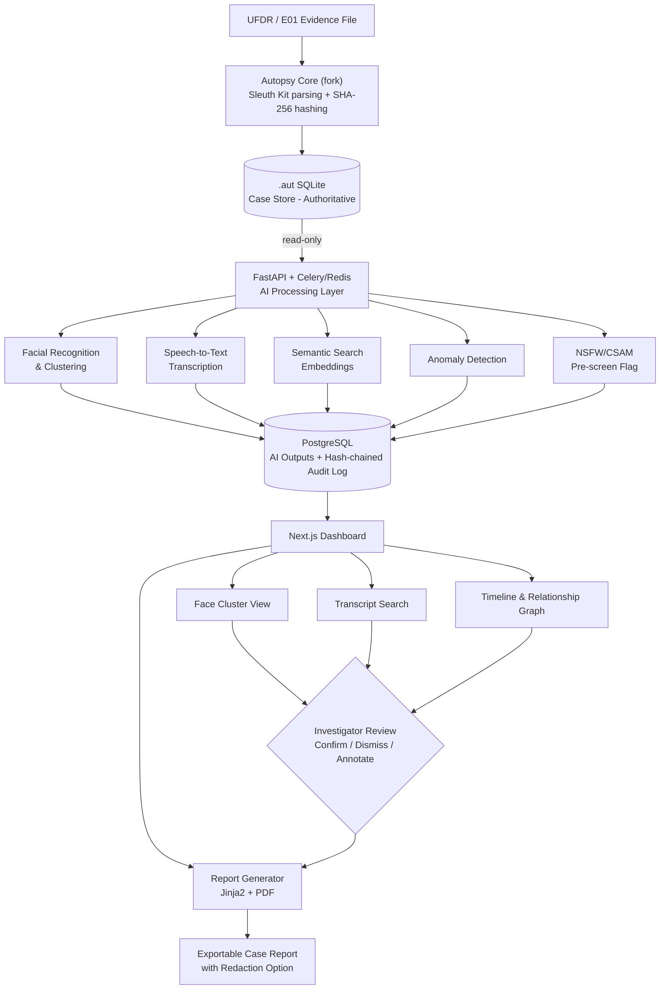

# NetSherlock — Project Proposal
### AI-Augmented Open-Source Digital Forensic Investigation Platform

---

## 1. Proposed Solution

### 1.1 Detailed Explanation

**NetSherlock** is an open-source digital forensic investigation platform built by forking **Autopsy** (the industry-standard open-source forensic suite powered by The Sleuth Tool Kit) and layering a modern **AI-driven triage and reporting engine** on top of it.

Investigators currently choose between two poor options:
- **Commercial suites** (Cellebrite, Magnet AXIOM) — powerful but closed-source, expensive licensing, and out of reach for smaller labs, state police cyber cells, NGOs, and academic/training institutions.
- **Free/open-source tools** (Autopsy) — trustworthy forensic parsing and chain-of-custody, but entirely manual review. An investigator must still scroll through thousands of photos, hours of call recordings, and endless chat threads by hand.

NetSherlock keeps Autopsy's proven, court-tested forensic core (UFDR/E01 ingestion, SHA-256 hashing, Sleuth Kit parsing) completely intact and untouched — and adds an **AI layer that runs alongside it, never inside the evidentiary chain**, to do the triage work a human currently does manually:

- Cluster faces across an entire photo/video dump to answer "who appears in this case?" in minutes instead of days.
- Transcribe every call recording and voice note, in multiple languages, into searchable text.
- Build a relationship graph and timeline automatically from contacts, call logs, and message metadata.
- Let an investigator search evidence **semantically** ("conversations about money transfers") instead of only by exact keyword.
- Flag anomalies (deleted-then-restored files, briefly installed apps) and NSFW/CSAM content for **priority human review** — never for automatic action.
- Generate a structured, exportable PDF/HTML report that aggregates every flagged item with its provenance.

### 1.2 How It Addresses the Problem

| Problem | NetSherlock's Response |
|---|---|
| Manual review of thousands of files takes days/weeks | AI-assisted clustering, transcription & semantic search cut first-pass triage time by an order of magnitude |
| Commercial tools are prohibitively expensive for smaller labs/NGOs/state cyber cells | 100% open-source, self-hostable, no per-seat licensing |
| Evidence integrity and court-admissibility concerns with AI tools | AI layer is strictly **read-only** on Autopsy's evidence store; every AI action is written to its own append-only, hash-chained audit log — original evidence hash trail is never touched |
| Investigators need to justify how a hit was found | Every AI-generated flag links back to its source file, timestamp, and confidence score — nothing is a "black box" verdict |
| Multilingual evidence (regional languages, code-mixed audio) | faster-whisper based STT with automatic language detection and multi-language transcription (translation-to-English is on the roadmap, see §7.2) |

### 1.3 Innovation and Uniqueness

- **Fork-and-augment, not rebuild** — rather than reinventing forensic parsing (a solved, certified, and legally trusted problem), NetSherlock builds *only* the AI layer that's missing, dramatically cutting build risk and inheriting Autopsy's existing courtroom credibility.
- **Dual-database separation of concerns** — Autopsy's native `.aut` SQLite case file remains untouched and authoritative; all AI outputs live in a separate PostgreSQL store. This means a bug, hallucination, or model update in the AI layer can *never* corrupt or silently alter primary evidence.
- **Flag-only AI philosophy** — the platform's most sensitive AI feature (NSFW/CSAM pre-screening) is deliberately restricted to "raise for human review," never "auto-classify" or "auto-delete." This is a conscious design choice for legal and ethical defensibility, not a technical limitation.
- **Tamper-evident AI audit trail** — every clustering run, transcription, and flag is itself hash-chained, so the AI layer's own findings are independently tamper-evident, extending the chain-of-custody principle to the AI outputs themselves.
- **Plugin-first extensibility** — built on Autopsy's existing Jython plugin framework, so future AI modules (new model, new file type, new language) can be dropped in without modifying the core.

---

## 2. Technical Approach

### 2.1 Tech Stack

| Layer | Technology | Rationale |
|---|---|---|
| Forensic ingest & parsing | Autopsy (fork) + The Sleuth Kit | Proven, court-accepted UFDR/E01 parsing — not reinvented |
| Case database | SQLite (`.aut`) | Native Autopsy format; AI layer accesses it read-only |
| AI-output storage | PostgreSQL | Isolates AI-generated data from the evidentiary DB |
| Backend API | FastAPI + Pydantic/SQLModel | Async, typed, fast to develop and test |
| Background job queue | Celery + Redis | Face clustering / transcription are slow — must not block the API |
| Facial recognition | facenet-pytorch (InsightFace-class) + scikit-learn clustering | Strong accuracy/speed trade-off at scale |
| Speech-to-text | faster-whisper | Fast local, multi-language transcription; scalable model size (`small` → `large-v3`) |
| Text-to-speech | pyttsx3 / Piper / Coqui TTS | Lightweight, offline-friendly accessibility playback |
| Semantic search | sentence-transformers + FAISS | Embedding-based search over transcripts/messages |
| NSFW/CSAM pre-screen | opennsfw2 | Flag-only pre-screening, human-reviewed |
| Report generation | Jinja2 + xhtml2pdf/WeasyPrint | HTML → PDF structured report export |
| Frontend | Next.js + Tailwind CSS + shadcn/ui | Fast to build, clean and consistent UI |
| Graph & timeline visualization | react-force-graph / d3.js | Relationship-graph and chronological timeline views |
| Frontend state | Zustand / React Query | Lightweight state/data-fetching, faster than Redux for this scope |
| Integrity layer | SHA-256 + hash-chained audit log | Tamper-evident chain-of-custody for both evidence and AI actions |

### 2.2 Methodology & Implementation Process

1. **Ingestion** — Investigator loads a UFDR/E01 image into the Autopsy fork; Sleuth Kit parses the filesystem, hashes every file (SHA-256), and writes the case to the `.aut` SQLite store — identical to stock Autopsy behavior.
2. **AI Job Dispatch** — From the NetSherlock dashboard, the investigator triggers one or more AI passes (facial clustering, transcription, semantic indexing, anomaly detection). FastAPI enqueues these as Celery tasks so the UI stays responsive.
3. **Processing** — Celery workers pull media/text from the read-only `.aut` store, run the relevant model, and write structured results (clusters, transcripts, embeddings, flags) to PostgreSQL, each entry appended to the hash-chained AI audit log.
4. **Review** — The dashboard surfaces face clusters, a searchable transcript index, a relationship graph, and a merged timeline (calls + messages + GPS/EXIF). The investigator confirms, dismisses, or annotates AI findings — nothing is auto-accepted as evidence.
5. **Reporting** — Confirmed findings are aggregated through Jinja2 templates into a structured PDF/HTML report, with an optional redaction pass (blurring faces/names) for court disclosure copies.
6. **Access Control** — Role-based access (investigator / reviewer / read-only) governs who can trigger AI jobs, confirm findings, or export reports, preserving accountability for chain-of-custody.

### 2.3 Flowchart

---

## 3. Feasibility and Viability

### 3.1 Technical Feasibility
- Every component in the stack is a mature, widely-adopted open-source library (Autopsy, FastAPI, Celery, faster-whisper, FAISS) — no unproven or experimental technology sits on the critical path.
- Forking Autopsy instead of building forensic parsing from scratch removes the single largest technical risk (correct, legally-trusted file system parsing) from the project's scope entirely.
- The AI layer degrades gracefully: per `DEPENDENCIES.md`, AI dependencies are lazy-imported, so the core API and forensic ingestion remain fully functional even if a given AI feature's model isn't installed — enabling a phased, resource-appropriate rollout.
- Local-first model choices (faster-whisper, facenet-pytorch, FAISS) mean the platform can run entirely offline/on-prem, a hard requirement for many forensic labs handling sensitive evidence.

### 3.2 Operational Feasibility
- Self-hostable on modest hardware (a single GPU-equipped workstation is sufficient for demo/small-lab scale); PostgreSQL/Redis are optional for local dev, with SQLite and eager task execution as zero-setup fallbacks.
- Role-based access control fits naturally into existing forensic lab workflows (examiner / reviewer / auditor).
- Plugin architecture (Autopsy's Jython framework) allows labs to add jurisdiction-specific or case-specific AI modules without waiting on core releases.

### 3.3 Economic Viability
- Zero licensing cost versus recurring commercial suite fees (Cellebrite/AXIOM licenses commonly run into lakhs of rupees per seat, per year).
- Open-source model enables community-driven maintenance and a lower total cost of ownership for government cyber cells, state forensic labs, and academic institutions.
- Cloud/on-prem hybrid deployment (roadmap item) lets adopters scale cost to case volume rather than paying flat license fees.

---

## 4. Challenges and Risks

| Challenge / Risk | Mitigation Strategy |
|---|---|
| AI outputs (false positive/negative face matches, transcription errors) could be mistaken for definitive evidence | Explicit "assistive triage only" design; every AI finding requires certified-examiner confirmation before use in proceedings; UI clearly labels AI confidence scores |
| Legal admissibility of AI-assisted findings varies by jurisdiction | AI layer never modifies or touches Autopsy's native evidence/hash trail; all AI actions are logged in a separate, tamper-evident audit chain that supports (not replaces) existing chain-of-custody procedures |
| NSFW/CSAM detection carries serious ethical and legal sensitivity | Strictly flag-for-human-review only — no auto-classification or auto-deletion; all flagged content still requires manual, qualified review |
| Performance: AI tasks (face clustering, transcription) are compute-heavy and could bottleneck large cases | Asynchronous processing via Celery/Redis keeps the API responsive; scalable model sizes (Whisper `small` → `large-v3`) let labs trade speed for accuracy based on hardware |
| Data privacy/security of highly sensitive case data | Self-hosted/offline-capable deployment; role-based access control; hash-chained audit logging for accountability |
| Model bias/accuracy degradation across lighting, accents, image quality | Documented as a known limitation; human review remains mandatory; roadmap includes expanded language support to reduce STT bias |
| Dependency and maintenance burden of forking an actively-developed upstream (Autopsy) | Clear separation between the untouched forensic core and the additive AI layer minimizes merge conflicts when pulling upstream Autopsy updates |
| Adoption resistance from investigators used to existing certified tools | Preserve Autopsy's familiar core workflow; AI features are additive and optional, not a replacement UI investigators must relearn from scratch |

---

## 5. Impact and Benefits

### 5.1 Social Impact
- Democratizes access to modern forensic AI tooling for under-resourced state police cyber cells, smaller labs, and NGOs working on cases (e.g., missing persons, trafficking, cybercrime) who currently cannot afford commercial suites.
- Faster triage means faster case resolution — directly benefiting victims and reducing backlog in the justice system.
- Multi-language transcription support improves access to justice in linguistically diverse regions like India, where evidence may span multiple regional languages and dialects.
- Responsible-AI design (flag-only NSFW/CSAM handling, mandatory human review) sets a defensible ethical standard for AI use in law enforcement contexts.

### 5.2 Economic Impact
- Substantial cost savings for government forensic labs and training institutions by eliminating recurring commercial licensing fees.
- Open-source, plugin-based architecture creates opportunity for a local ecosystem of forensic-AI tool developers and contributors rather than dependency on foreign proprietary vendors.
- Reduced investigator hours per case lowers the operational cost of digital forensic investigations at scale.

### 5.3 Environmental Impact
- Local, on-prem deployment options (versus mandatory cloud processing in many commercial tools) allow labs to right-size compute to actual case load, avoiding always-on cloud infrastructure.
- Efficient model choices (e.g., `faster-whisper`, quantizable model sizes) reduce compute/energy footprint compared to running large general-purpose cloud AI services for the same tasks.

---

## 6. Research and References

1. Autopsy — Open Source Digital Forensics Platform, Basis Technology / Sleuth Kit Labs — https://www.autopsy.com/
2. The Sleuth Kit (TSK) — https://www.sleuthkit.org/
3. faster-whisper — CTranslate2-based reimplementation of OpenAI Whisper for fast local speech-to-text — https://github.com/SYSTRAN/faster-whisper
4. Radford, A. et al., "Robust Speech Recognition via Large-Scale Weak Supervision" (Whisper), OpenAI, 2022.
5. facenet-pytorch — PyTorch implementation of FaceNet for facial recognition/embedding — https://github.com/timesler/facenet-pytorch
6. Schroff, F., Kalenichenko, D., Philbin, J., "FaceNet: A Unified Embedding for Face Recognition and Clustering," CVPR 2015.
7. Reimers, N., Gurevych, I., "Sentence-BERT: Sentence Embeddings using Siamese BERT-Networks" (sentence-transformers), EMNLP 2019.
8. FAISS — Facebook AI Similarity Search, for scalable vector similarity indexing — https://github.com/facebookresearch/faiss
9. opennsfw2 — Open-source NSFW image detection model — https://github.com/bhky/opennsfw2
10. Casey, E., "Digital Evidence and Computer Crime: Forensic Science, Computers, and the Internet," Academic Press — foundational reference on chain-of-custody and evidentiary integrity principles applied in this project's audit-log design.
11. NIST Special Publication 800-86, "Guide to Integrating Forensic Techniques into Incident Response" — reference for forensic process and evidence handling standards.
12. Comparative context: Cellebrite UFED and Magnet AXIOM (commercial digital forensic suites) — used as the baseline for cost/accessibility comparison in the problem statement.

---

## 7. Autopsy Feature-Parity Roadmap

NetSherlock forks Autopsy's philosophy, not (yet) its full breadth. Autopsy is a 15+ year mature platform with dozens of ingest modules; the table below inventories what upstream Autopsy ships (per [sleuthkit.org/autopsy/features.php](https://www.sleuthkit.org/autopsy/features.php) and the [sleuthkit/autopsy](https://github.com/sleuthkit/autopsy) module tree) against NetSherlock's current implementation, so the gap is a concrete backlog rather than a vague aspiration.

Legend: ✅ have · 🔶 partial · ⬜ not started

### 7.1 Ingest & analysis modules

| Autopsy capability | NetSherlock status | Notes |
|---|---|---|
| Disk image ingestion (E01/raw/dd, multi-segment) | ✅ | `e01_ingestion.py` via pytsk3/libewf; now supports multiple data sources per case |
| Cellebrite UFDR ingestion | ✅ | `ufdr_ingestion.py` |
| Local folder / case-export ingestion | ✅ | `ingestion.py` (`CaseFolderParser`) |
| SHA-256 hashing at ingest | ✅ | every `EvidenceFile` row |
| Hash Set Filtering (NSRL known-good, custom known-bad hashsets) | ⬜ | not started |
| File Type ID / signature vs. extension mismatch detection | 🔶 | `file_signature.py` detects mismatches during folder ingestion, but it's not surfaced as an investigator-facing flag/filter yet |
| File Type Sorting (group by type) | ✅ | Photos/Videos/Audio/Documents/Other sidebar filters |
| EXIF metadata extraction (geo + camera) | ✅ | `captured_at`, `latitude`/`longitude` on `EvidenceFile` |
| Deleted file recovery / carving (PhotoRec/Scalpel-equivalent) | 🔶 | `deleted_then_recovered` flag exists on evidence; no unallocated-space carving engine |
| Keyword search + regex over raw file content/unallocated space | 🔶 | search today is semantic + keyword over transcripts/messages (`semantic_search.py`), not a full-text index of every file |
| Unicode strings extraction (unallocated space, multi-language) | ⬜ | not started |
| Registry analysis (RegRipper — recent docs, USB history) | ⬜ | not started |
| LNK file analysis | ⬜ | not started |
| Email analysis (MBOX/Thunderbird) | ⬜ | not started |
| Web artifacts (browser history/cookies/downloads) | ⬜ | not started |
| Android/iOS app parsing (ALEAPP/iLEAPP-class: SMS, call logs, contacts, third-party apps) | 🔶 | UFDR ingestion covers contacts/calls/messages; no dedicated per-app parsers beyond that |
| Interesting Items (flag by filename/path rule) | ⬜ | not started |
| Encryption detection | ⬜ | not started |
| Virtual machine image extraction (VMDK/VHD inside an image) | ⬜ | not started |
| YARA rule scanning | ⬜ | not started |
| Drone data parsing | ⬜ | not applicable to current case profile |
| Plaso/log2timeline super-timeline ingestion | ⬜ | NetSherlock has its own simpler `timeline_builder.py` |

### 7.2 AI / triage layer — NetSherlock's actual differentiator

| Capability | Autopsy (upstream) | NetSherlock |
|---|---|---|
| Facial recognition & clustering | ⬜ (none built-in) | ✅ `face_recognition.py` + `Person` clustering |
| Speech-to-text transcription | ⬜ | ✅ faster-whisper, multi-language |
| Speech translation | ⬜ | ⬜ not yet wired (README overstates this — `transcription.py` has no translate path today) |
| Text-to-speech playback | ⬜ | ✅ `tts.py` |
| Semantic (embedding) search | ⬜ | ✅ `semantic_search.py` |
| NSFW/CSAM pre-screening flag | ⬜ | ✅ flag-only, human-reviewed |
| Anomaly detection (deleted-then-recovered, odd install patterns) | ⬜ | ✅ `anomaly_detection.py` |
| Report redaction (blur faces/names for disclosure) | ⬜ | ✅ `redaction.py` |
| AI-generated document/text summarization | 🔶 (Autopsy has an experimental text summarizer) | ⬜ not started |

### 7.3 Case management, viewers & reporting

| Autopsy capability | NetSherlock status | Notes |
|---|---|---|
| Multi-user case collaboration (shared case, coordination service) | 🔶 | RBAC login exists; no concurrent-access locking/coordination layer |
| Multiple data sources per case | ✅ | fixed this session — `DataSource` model + `/cases/{id}/data-sources` endpoints |
| Central Repository (cross-case correlation of hashes/numbers/emails) | ⬜ | search/graph are per-case only |
| Common Properties Search (files common across sources/cases) | ⬜ | not started |
| Timeline analysis (graphical, zoomable) | 🔶 | `TimelineEvent` model + Timeline view exist; less graphically rich than Autopsy's zoomable timeline |
| Communications visualization (call/message graph) | ✅ | `entity_graph.py` + graph view |
| Geolocation map view (routes/waypoints) | 🔶 | lat/long stored and filterable ("Geotagged photos"); no dedicated map/route UI confirmed |
| Image gallery / thumbnail viewer | ✅ | Table/Thumbnail/Cluster Grid views |
| Hex / strings / raw content viewers | ⬜ | only media-appropriate previews today |
| HTML report export | ✅ | `report_generator.py` + `report_template.html` |
| Excel / KML / STIX / body-file (mactime) report formats | ⬜ | HTML/PDF only |
| Portable case export | ⬜ | not started |
| Command-line / headless batch ingest | ⬜ | API-only today |
| Logical Imager / Live Triage (standalone lightweight collection) | ⬜ | not started |
| Tags & investigator comments | ⬜ | not started (NSFW review flag is the closest analogue) |
| Role-based access control | ✅ | investigator / reviewer / read_only |
| Tamper-evident audit log | ✅ | hash-chained, exceeds Autopsy's own audit tooling |

### 7.4 Suggested build order

Roughly in order of investigator value per unit of effort:

1. **Hash Set Filtering (NSRL + custom known-bad hashsets)** — cheap, high-trust win; filters out OS noise fast.
2. **Full-text keyword search + regex over all ingested files** (not just transcripts/messages) — the single most-used Autopsy feature.
3. **Tags & investigator comments** on any evidence item — needed before Interesting Items or Central Repository make sense.
4. **Interesting Items module** (flag by filename/path rule) — small, reuses the tagging model above.
5. **Registry + LNK + web-artifact parsers** for Windows-image cases (skip if the case profile is mobile-only).
6. **Central Repository** — cross-case correlation, once there's more than one case worth correlating.
7. **Report format expansion** (KML for geolocation, body-file for external timeline tools, portable case export).

---

*This document accompanies the project README (`README.md`) and dependency manifest (`DEPENDENCIES.md`) in this repository, which contain the full setup, architecture, and current implementation status.*
